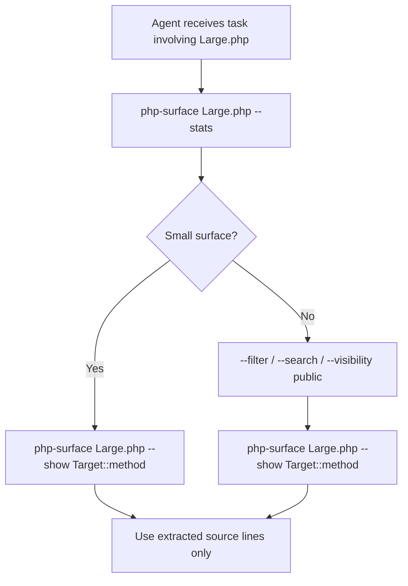

# Claude Code

Use **php-surface** with [Claude Code](https://docs.anthropic.com/en/docs/claude-code) so agents explore large PHP files incrementally — structural map first, full source only when needed.

This guide installs php-surface **inside your PHP project workspace**, makes the CLI invocable from any directory, and adds rules to `CLAUDE.md` so the agent reaches for php-surface before reading entire files.

For flag details and sample output, see [Commands](../cli/reference.md) and [Output Examples](../cli/examples.md).

## Prerequisites

| Requirement | Notes |
|-------------|-------|
| **PHP 8.3+** | Runtime for php-surface only; your app's PHP version does not matter |
| **Composer** | To install php-surface dependencies |
| **Claude Code** | Installed and authenticated (`claude --version`) |
| **Git** | To clone php-surface into your project |

php-surface is **not on Packagist yet** — install from the GitHub repository (clone or submodule).

## Install in your project

The recommended layout keeps php-surface as a **local tool** under your project root (committed or gitignored, your choice).

```bash
# From your PHP project root
git clone https://github.com/marceloxp/php-surface.git tools/php-surface
cd tools/php-surface
composer install --no-dev
cd ../..
```

Verify the wrapper:

```bash
tools/php-surface/bin/php-surface --version
# php-surface 0.1.0-dev
```

!!! tip "Submodule"
    To pin a version and track upstream:  
    `git submodule add https://github.com/marceloxp/php-surface.git tools/php-surface`

### Alternative layouts

| Layout | When to use |
|--------|-------------|
| `tools/php-surface/` | Default — one clone per project, easy to reference in `CLAUDE.md` |
| Shared clone outside the repo | Several projects on one machine — add that clone's `bin` to your shell `PATH` once |
| Symlink | `ln -s /path/to/php-surface tools/php-surface` if you already maintain a local clone |

Do **not** assume `composer require` until php-surface is published to Packagist.

## Make the CLI invocable

Claude Code runs shell commands from your project directory. Pick one approach and document it in `CLAUDE.md` so the agent uses the same invocation every time.

| Approach | Setup | Agent runs |
|----------|-------|------------|
| **PATH (recommended)** | Add to shell profile or project env: `export PATH="/path/to/your-project/tools/php-surface/bin:$PATH"` | `php-surface /absolute/path/to/File.php` |
| **Full path** | No PATH change | `/path/to/your-project/tools/php-surface/bin/php-surface /absolute/path/to/File.php` |
| **PHP binary override** | When default `php` is &lt; 8.3 | `PHP_SURFACE_BIN_PATH=/usr/bin/php8.3 php-surface ...` |

Always pass the **absolute path** to the PHP file under analysis (see [Installation](../getting-started/installation.md#file-path-argument)). Relative paths depend on the agent's current working directory and often fail silently or resolve to the wrong file.

After adding `bin` to `PATH`, confirm from your project root:

```bash
php-surface --version
php-surface /absolute/path/to/your-project/src/Service/OrderService.php --stats
```

## CLAUDE.md snippet

Copy the block below into your project's `CLAUDE.md` (create the file at the repo root if it does not exist). Adjust `/path/to/your-project` to match your layout.

````markdown
## PHP structural exploration (php-surface)

Before using the Read tool on a PHP file larger than ~200 lines, explore it with php-surface:

1. `php-surface /absolute/path/to/File.php --stats` — file size, symbol counts, largest classes
2. `php-surface /absolute/path/to/File.php --filter <term>` or `--search <term>` — narrow to relevant methods
3. `php-surface /absolute/path/to/File.php --show ClassName::method` — read one method body only when needed

Rules:

- Default output is JSON (preferred for agents). Use `--text` only when a human-readable map is requested.
- Always pass the **full absolute path** to the `.php` file.
- If exit code is **3**, output exceeded the 8 KB guard — follow stderr hints (`--stats`, `--filter`, `--search`, `--visibility`). Do **not** use `--allow-large-output` unless the task truly requires the full symbol map.
- php-surface is installed at: `/path/to/your-project/tools/php-surface` (`bin` is on PATH as `php-surface`).

Do not read the entire PHP file when a structural map or `--show` excerpt is sufficient.
````

Replace the install path line if you use a full-path invocation instead of PATH.

## Claude Code permissions

Claude Code executes php-surface through its **Bash** tool. On first run you may be prompted to approve the command — allow it for your project session or add a persistent rule.

Practical tips:

- **Run a manual smoke test** before relying on the agent:  
  `php-surface /absolute/path/to/a/large/file.php --stats`
- **Keep the binary path stable** — moving `tools/php-surface` breaks allowlists and `CLAUDE.md` references.
- **Project settings** — if your Claude Code version supports command allowlists or permission rules, allow `php-surface` (or the full path to `tools/php-surface/bin/php-surface`) as a safe, read-only analysis command. Consult the [Claude Code documentation](https://docs.anthropic.com/en/docs/claude-code) for your version's permission model.

php-surface only **reads and parses** PHP source; it never executes the analyzed code.

## Incremental workflow



Human-readable version:

1. **`--stats`** — decide whether the file is worth exploring and identify large classes.
2. **`--filter` / `--search` / `--visibility`** — shrink the symbol map to what matters for the task.
3. **`--show`** — pull source for one method when implementation detail is required.

Avoid opening the full file in the Read tool until steps 1–3 show that broader context is necessary.

## Environment variables

| Variable | Use with Claude Code |
|----------|----------------------|
| `PHP_SURFACE_BIN_PATH` | Point the wrapper at PHP 8.3+ when `php` on `PATH` is too old (common in mixed-version environments). |
| `PHP_SURFACE_MAX_OUTPUT_BYTES` | Raise the stdout cap (default `8192`) only if the agent's context window can absorb it — prefer filters first. |

Example for a pinned PHP binary:

```bash
export PHP_SURFACE_BIN_PATH=/usr/bin/php8.3
php-surface /absolute/path/to/File.php --stats
```

See [Commands → Environment variables](../cli/reference.md#environment-variables) for defaults and behavior.

## Troubleshooting

| Problem | What to check |
|---------|----------------|
| **`command not found: php-surface`** | `bin` is not on PATH in the shell Claude Code uses. Fix: add `export PATH=".../tools/php-surface/bin:$PATH"` to your profile, or use the full path to `bin/php-surface` in `CLAUDE.md`. |
| **Exit code `2` — parse error** | The target file has invalid PHP syntax. Fix the source file; this is not a php-surface bug. |
| **Exit code `3` — output too large** | Full map exceeds the guard. Run `--stats`, then `--filter` / `--search` / `--visibility` per stderr hints. Avoid `--allow-large-output` unless you intentionally need the entire map. See [Exit codes](../cli/exit-codes.md#3-output-too-large). |
| **Agent reads the whole file anyway** | Strengthen `CLAUDE.md`: require php-surface **before** Read on files over N lines; mention exit code `3` handling explicitly. |
| **Wrong file or empty output** | Agent used a relative path from the wrong cwd. Require **absolute paths** in `CLAUDE.md`. |
| **PHP version error from wrapper** | Set `PHP_SURFACE_BIN_PATH` to a PHP 8.3+ binary. |

## Optional: agent skill (advanced)

You can wrap this workflow in a **skill** (Claude Code, Cursor, or similar) with triggers like "explore PHP file" or "php surface map". Skills live in project-specific directories (for example `.cursor/skills/` in Cursor) and encode the `--stats` → `--filter` / `--search` → `--show` sequence so agents do not rely on memory alone.

This is optional — the `CLAUDE.md` snippet above is enough for most projects. See your editor's skill documentation when you want reusable, trigger-based automation.

## Related

- [Installation](../getting-started/installation.md) — PHP requirements and PATH setup
- [Quick Start](../getting-started/quickstart.md) — first commands
- [Commands](../cli/reference.md) — all flags and options
- [Output Examples](../cli/examples.md) — JSON and `--text` samples
- [Exit codes](../cli/exit-codes.md) — codes 0–3
